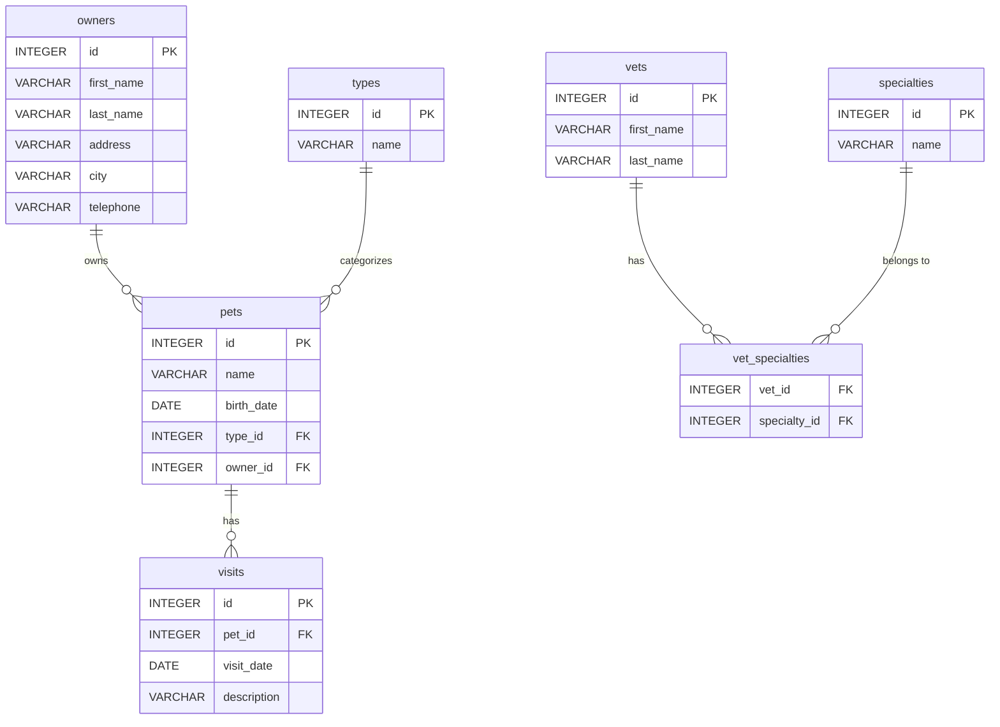
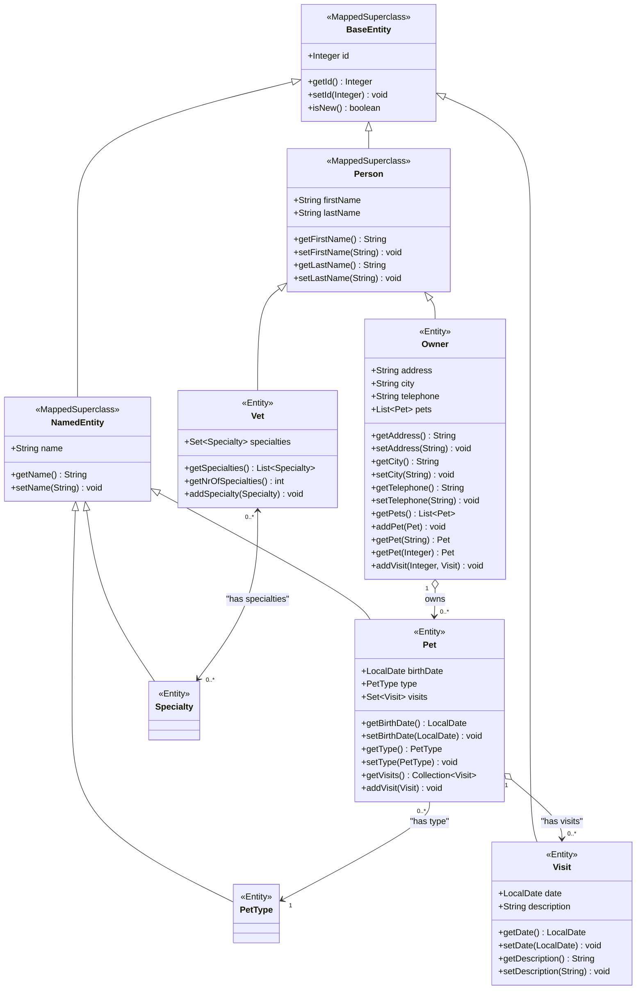

# Spring Pet Clinic Information

* [Spring Reference Implementation](https://github.com/spring-projects/spring-petclinic/tree/main)
* [Spring PetClinic Community](https://spring-petclinic.github.io/)

# Spring Pet Clinic Design Information

## Database ERD

## JPA Class Diagram 

